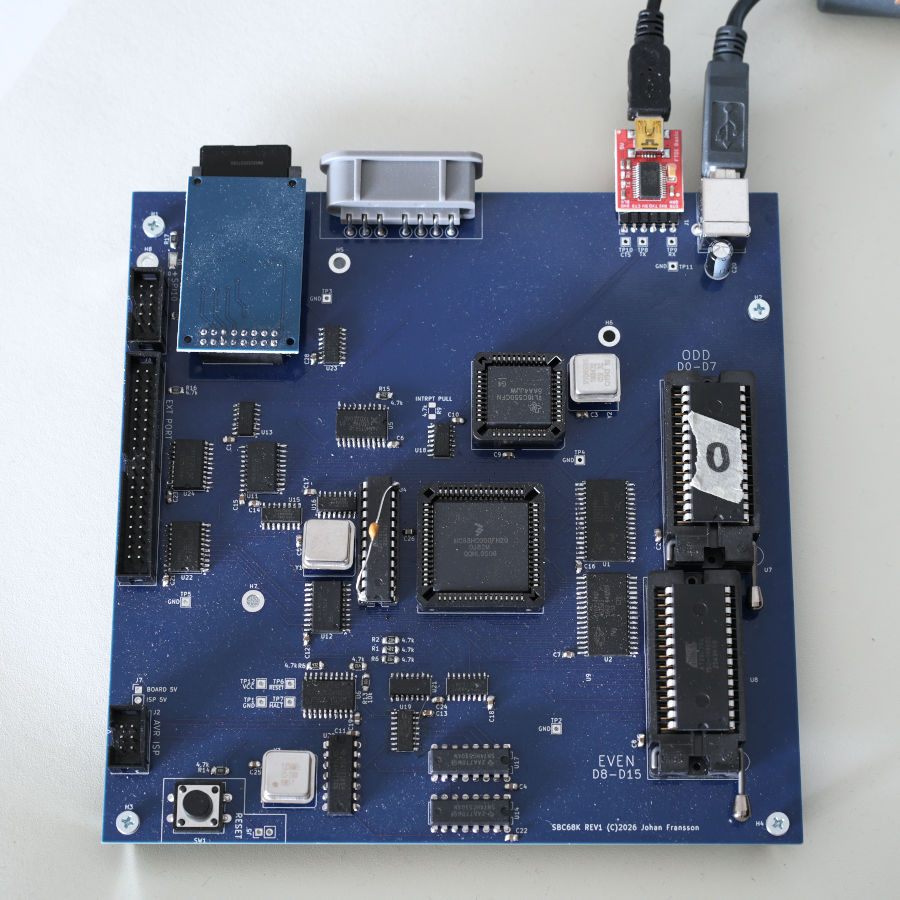

# JOFMODORE SE 68000-based hardware & emulator

This repository is about my 68000-based SBC, working name 
"JOFMODORE SE" (SE meaning Sixtyeight) that contains an emulator (EMUSE, EMUlator Sixty Eight thousand) and also bios/kernel/software written for the hardware.

## System description

### Specifications

* 68HC000FN clocked at 14.7 MHz
* 1 MB RAM 
* 64 KB (EEP)ROM
* 16C550 UART enabling 115200 baud serial connection via USB-adapter.
* MMC/SD-card reader
* SNES controller connector
* External SPI-port
* External peripheral-port (8-bit) intended for graphics and/or sound
* Custom timer circuit built from discrete components, allowing
  75/150/300 Hz rate, with interrupt circuitry 
* FAT-16 filesystem on MMC, with ability to autoboot "SYSTEM.BIN" if present in the root folder

### Planned additions
* VGA graphics card/audio via peripheral port
* Multiple partition support, in case 4 GB is not enough :)

### Maybe in the future
* Multitasking using the timer, user/supervisor mode split.

## Emulator
Per instruction emulator of the 68000 CPU with autovector interrupt emulation